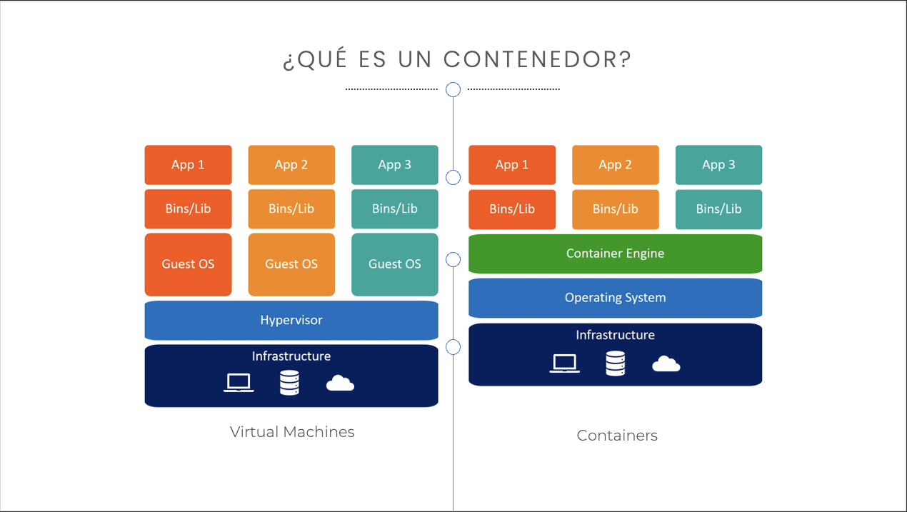
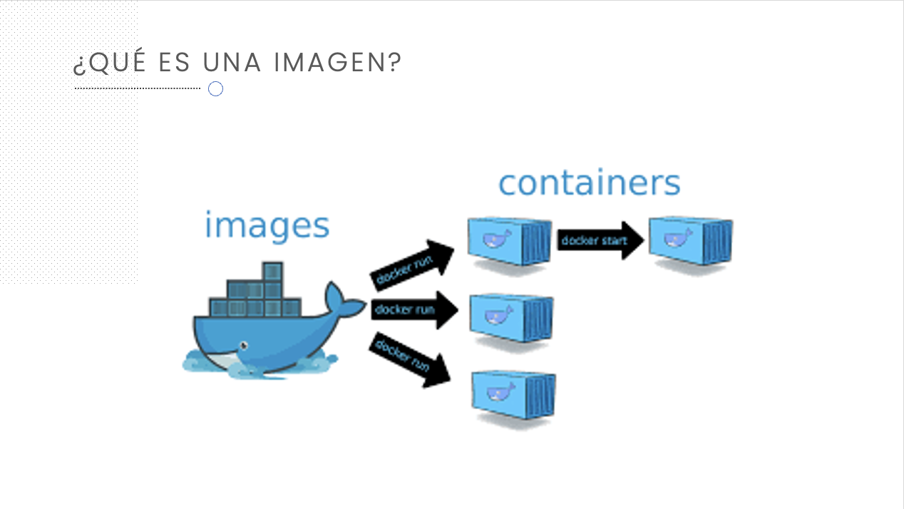
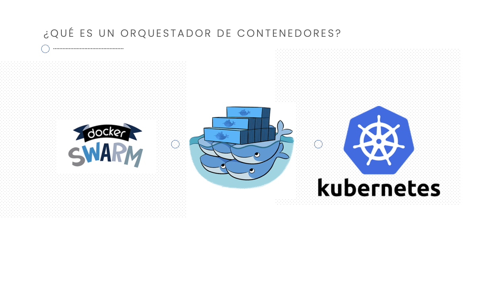
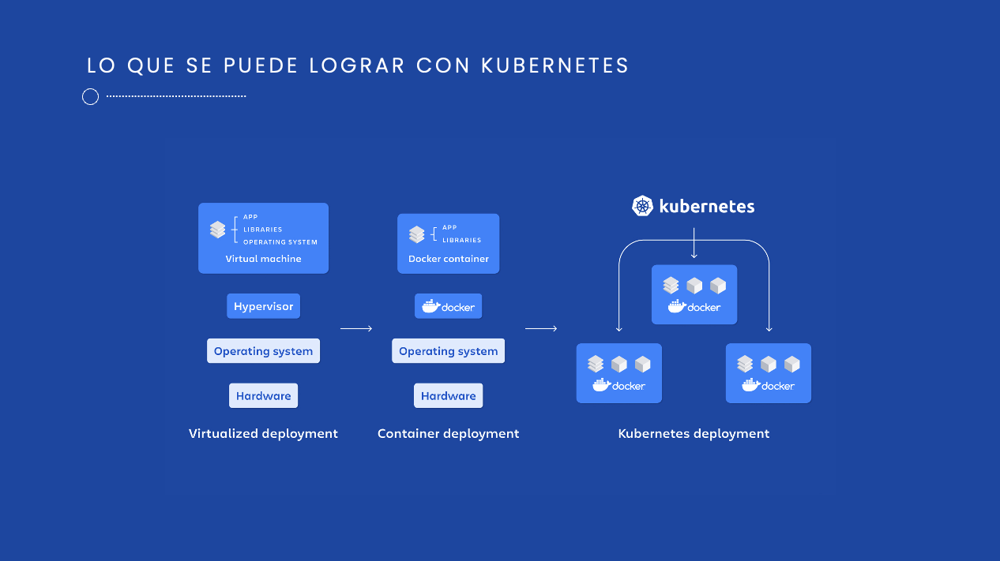
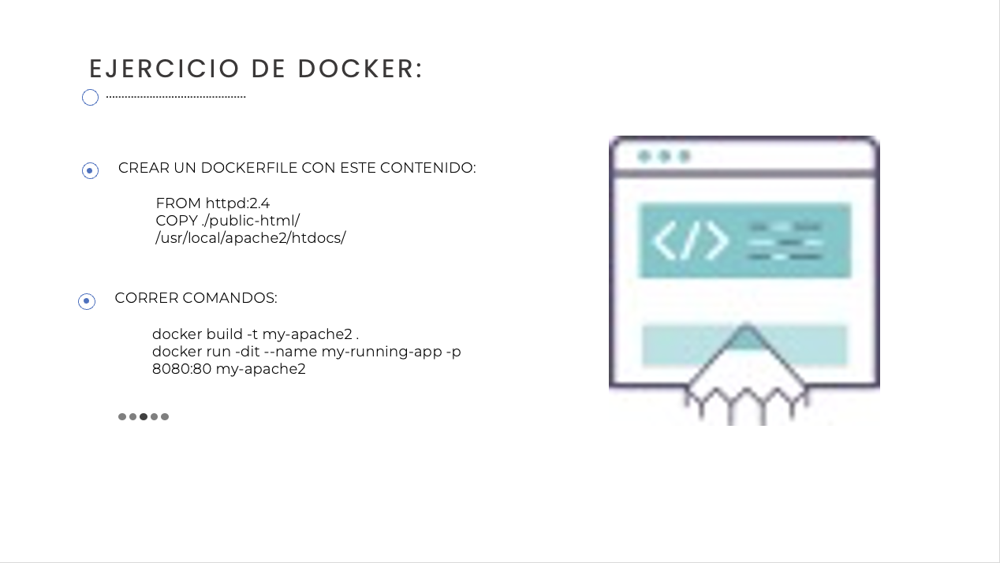

# Clase 1







### Comandos:
Crear un Dockerfile con este contenido:
```
FROM httpd:2.4 
COPY ./public-html/ /usr/local/apache2/htdocs/
```
Correr Comandos:
```
docker build -t my-apache2 .
docker run -dit --name my-running-app -p 8080:80 my-apache2
```


