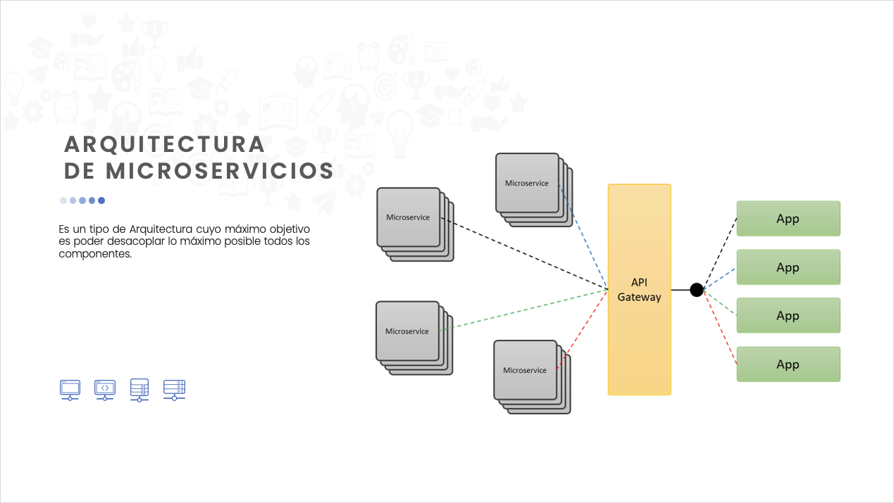
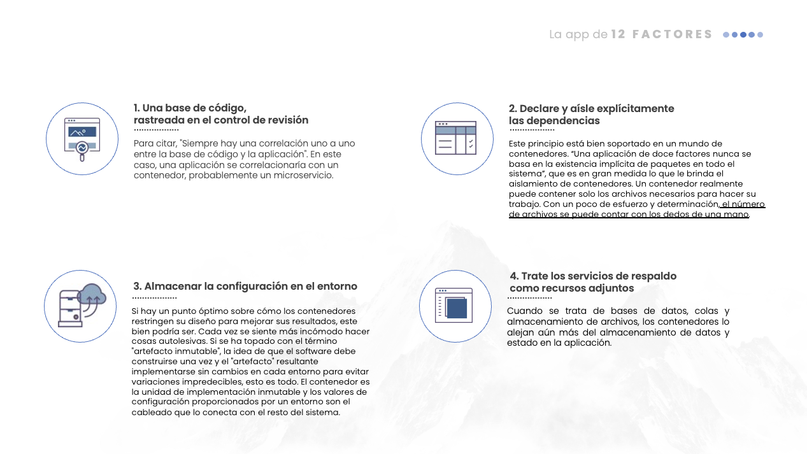
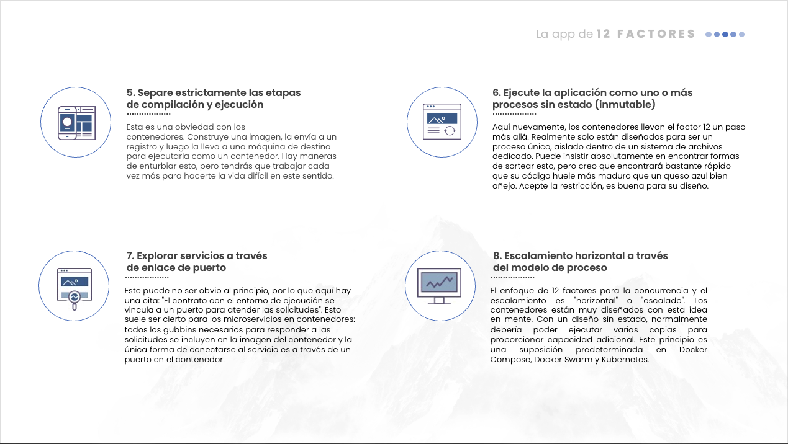
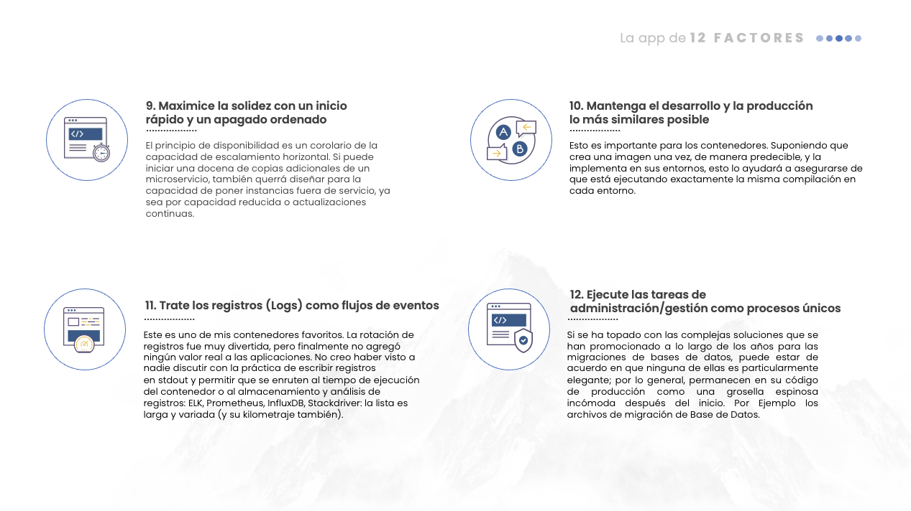
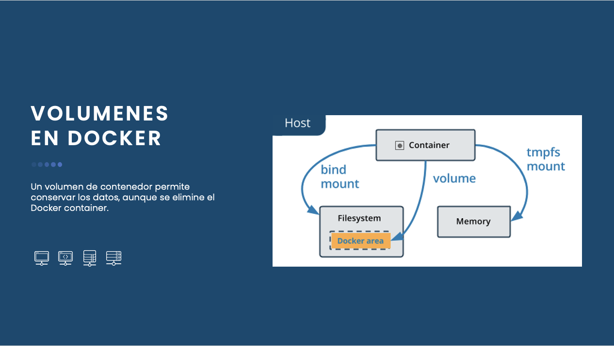
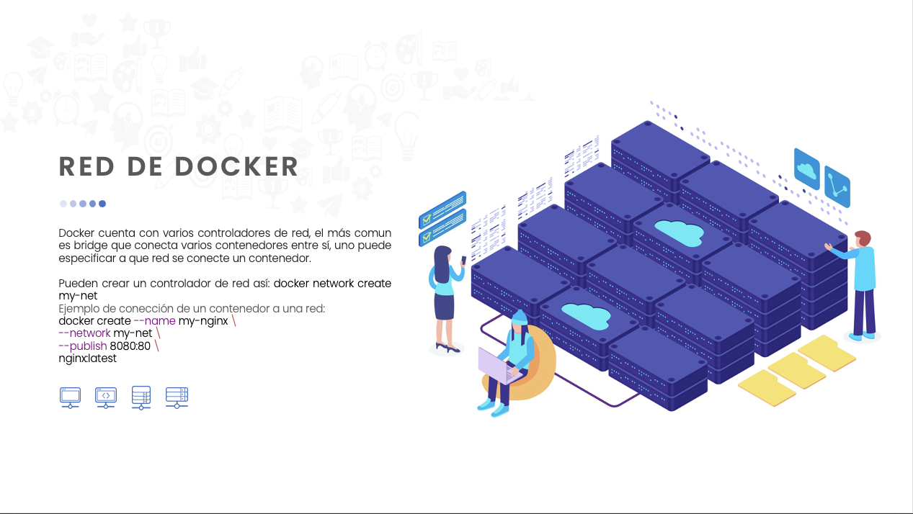

# Clase 2

### Ejercicio:
Correr Comandos:

`docker network create --driver bridge mysql-net`

`docker run --name db --network mysql-net -e MYSQL_ROOT_PASSWORD=password -p 3306:3306 -d mysql`

`docker run --name phpmyadmin --network mysql-net -e PMA_HOST=db -e MYSQL_ROOT_PASSWORD=password -e PMA_PORT=3306 -d -p 8080:80 phpmyadmin/phpmyadmin`

